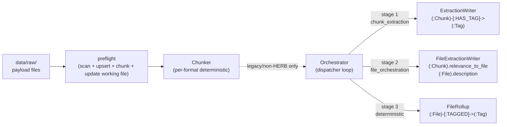

# Agent Brief

**TL;DR.** This is the minimum context an agent (or new human) needs to be productive in this repo. For HERB, the verified path is currently preflight/chunking only: raw files under `data/raw/Salesforce__HERB/` become `:Source`, `:File`, and `:Chunk` graph content with structural relationships. The old generic LLM tagging path is legacy and is blocked for HERB unless explicitly overridden. There are **no fallbacks, no mocks, no side files**: Neo4j is the only durable store.

**When to read this.** First — before touching anything. Re-read it if you've been off this repo for a while.

**Last updated:** 2026-05-13.

## Touched paths

This brief references: `agents/`, `indexing/`, `prompts/`, `schema/`, `scripts/`, `shared/`, `data/raw/`, `data_access/raw/`.

## Mission

Bridge heterogeneous, noisy datasets with a queryable graph artefact. Every HERB file becomes a chain of `(:Chunk)` nodes with stable locators and source/file structure. The old generic tag extraction and file rollup code still exists, but it is not the active HERB contract.

## High-level architecture



Stage 1 and 2 are LLM-driven legacy stages. Stage 3 is pure Cypher. HERB work currently stops after preflight/chunking.

## The five clusters

Defined in [`agents/schemas.py`](../agents/schemas.py) as the `Cluster` Literal for the legacy LLM tagging path. HERB chunking does not depend on a canonical seed vocabulary.

| Cluster | Question for the chunk |
|---|---|
| `topic` | What is this chunk about? |
| `entities` | Which specific concrete things are named or referenced (persons, organisations, products, systems, campaigns, documents, datasets)? |
| `activity` | Which kind of event, process, or content action is described (decision, change, incident, launch, measurement, agreement, publication)? |
| `temporal` | When is this relevant for retrieval (recent, historical, future, active, completed), including status posture when no explicit date appears? |
| `evidence` | What kind of answer material is supplied (number, quote, cause, summary, comparison, status, confirmed_fact)? |

Cluster is stored as a **string property on the `HAS_TAG` and `TAGGED` edges**. There are no `(:Dimension)` nodes. The `(:Tag)` node is unique on `name` only; the cluster lives on the edge.

## Hard rules

1. **No fallbacks. No mocks.** The pipeline fails loud. There is exactly one LLM endpoint; if it's down, you abort.
2. **One OpenAI-compatible LLM endpoint.** Configured via `LLM_*` env (legacy `AGENT_*` aliases honoured — `LLM_*` wins). See [`env_and_config.md`](env_and_config.md).
3. **The agent client never raises.** [`agents/client.py`](../agents/client.py) catches every `httpx`/schema error and returns a typed `AgentResult` with an `error_class`. The orchestrator decides what to do.
4. **Per-error-class circuit breaker.** [`indexing/breaker.py`](../indexing/breaker.py) tracks consecutive counts and rolling-window rates per error class. Trips raise `BreakerTripped`; the orchestrator stops pulling new work and the run finishes as `aborted`.
5. **Working file drives agent jobs.** Scheduler state lives in `backend/.work/worklist_<neo4j_database>.json`, not in the graph. Files that produce zero chunks (for example images or archives) are registered as `:File` but skipped by the LLM worklist. The orchestrator pulls `unrun` items and marks them `done` or `failed` in the working file. New runs auto-reset all `failed` items to `unrun`.
6. **Neo4j is the graph artefact.** Do not put scheduler/job rows in the graph. Re-running pre-flight is idempotent (skips files that already have chunks).

## Where to look first when changing X

| You want to change… | Look in… |
|---|---|
| Agent prompts (system messages) | [`prompts/extract_chunk.md`](../prompts/extract_chunk.md), [`prompts/file_descriptor.md`](../prompts/file_descriptor.md) |
| Tag / extraction JSON schema | [`agents/schemas.py`](../agents/schemas.py) (`Tag`, `ChunkExtraction`, `FileOrchestrationOutput`) |
| Chunking strategy per format | [`indexing/chunker.py`](../indexing/chunker.py) (`Chunker._produce_chunks`) |
| Database constraints / indexes | [`schema/constraints.cypher`](../schema/constraints.cypher), [`schema/indexes.cypher`](../schema/indexes.cypher) |
| Dispatcher loop / batch sizes | [`indexing/orchestrator.py`](../indexing/orchestrator.py) |
| Circuit breaker thresholds | [`indexing/breaker.py`](../indexing/breaker.py) (`BreakerThresholds`) |
| Working-file job state transitions | [`indexing/worklist.py`](../indexing/worklist.py) |
| Per-run lifecycle / abort | [`indexing/runs.py`](../indexing/runs.py), [`scripts/run_index.py`](../scripts/run_index.py) |
| File rollup math | [`indexing/file_rollup.py`](../indexing/file_rollup.py) |
| Env vars / config | [`shared/config.py`](../shared/config.py), [`.env.example`](../.env.example) |
| What is verified working | [`status.md`](status.md) |

## End-to-end run (concrete commands)

Assumes a populated `.env` (see [`env_and_config.md`](env_and_config.md)) and Neo4j up at `NEO4J_URI`.

```bash
python -m venv .venv
. .venv/Scripts/activate                         # Windows; Linux: . .venv/bin/activate
pip install -r requirements-lock.txt

# 1. Apply constraints + indexes. Idempotent.
python scripts/bootstrap_schema.py

# 2. Scan data/raw/, upsert (:Source) and (:File), chunk, update working file. Idempotent.
python scripts/run_preflight.py

# 3. Legacy generic tagging is blocked for HERB unless explicitly overridden.
python scripts/run_index.py

# Optional: inspect counts.
python scripts/verify_graph.py
```

`run_index.py` accepts `--dataset-id`, `--file-id`, `--chunk-limit`, `--file-limit`, `--concurrency`. See its `--help` and [`runbook.md`](runbook.md) for partial-failure recovery.

## Backlog (carry-over, not in code)

Pulled from [`status.md`](status.md). Truthful snapshot:

- Parquet visual-content path: chunker now omits Arrow columns containing binary data and caps nested JSON conversion, so DocVQA preflights cleanly. Future image-aware indexing still needs a proper visual path.
- HERB-specific extraction/tagging is not built yet; do not use the legacy generic tagging path as evidence for HERB quality.
- Named cluster query views (`by_topic`, `by_evidence`, `recent_active`, `multidim`) are not built.
- Portable JSONL graph export/import exists via `scripts/export_graph_json.py`, `scripts/import_graph_json.py`, and `graph_export/grag_graph_latest.zip`; it is an operator snapshot, not an indexing-path side artefact.
- Full `provenance.json` per run is not written.
- Vector indexes / embeddings are deferred (see [`schema/vector_indexes.cypher`](../schema/vector_indexes.cypher)).
- Agent-negotiated chunking (vs Path A deterministic) for long-form sequential files is an explicit future revisit (see [`architecture.md`](architecture.md)).

## Anti-patterns to avoid

- Adding a "try local model if remote fails" branch. **Don't.** Fail loud.
- Adding a `(:Dimension)` node or a `(:Tag {cluster})` uniqueness constraint. Cluster lives on the edge.
- Calling `MATCH (n) DETACH DELETE n` without confirming you're in the project's `NEO4J_DATABASE`.
- Creating side files (parquet, JSON) in `data/` from the indexing path. The graph is the artefact.
- Editing the JSON schema in a prompt without updating the matching pydantic model in [`agents/schemas.py`](../agents/schemas.py) in the same change.
