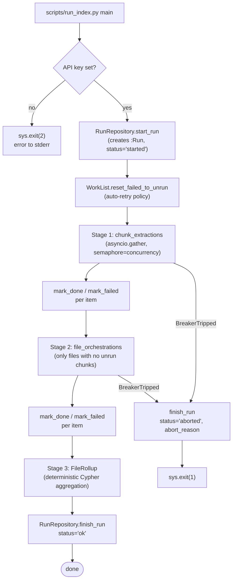

# Architecture

**TL;DR.** The pipeline has three logical layers — **access** (join raw bytes to graph-addressable corpus identity via inventory, typing, stable keys, and `:Source` / `:File` anchors), **indexing** (segment into `(:Chunk)` with locators, job ledger, LLM extraction/tagging, rollups), and **clustering** (the canonical-tag vocabulary plus future query views). Everything durable lives in Neo4j. This doc captures the design decisions that produced the current shape, the run lifecycle, and the dispatch strategy.

**When to read this.** When you need to understand *why* the code is shaped the way it is, before changing anything load-bearing.

## Thesis scope (HERB) and quarantine

**HERB in use:** **`Salesforce__HERB`** under `data/raw/`, Neo4j database **`herb`**, semantic run **`pilot_full_herb`**. Live path: **access layer** (inventory + `:Source` / `:File`) → **`run_preflight`** (HERB-aware chunking, `locator_json`, worklist seed) → **`python -m tagging`** ([`tagging/pipeline.py`](../../backend/tagging/pipeline.py), Anthropic two-pass). HERB contracts and results: [`herb_tagging_schema.md`](herb_tagging_schema.md), [`herb_tagging_frames.md`](herb_tagging_frames.md), [`pilot_full_herb_report.md`](pilot_full_herb_report.md). HERB-first navigation (legacy quarantined in one place): [`../system_map.md`](../system_map.md).

**Quarantine (not the HERB thesis delivery):** **`scripts/run_index.py`**, **`indexing/orchestrator.py`**, **`agents/`**, and the **`prompts/extract_chunk.md`** / **`file_descriptor.md`** pipeline are the **legacy generic three-stage indexer** (OpenAI-compatible). They **refuse HERB** unless `--allow-legacy-herb-tagging`. Other datasets in [`data_access/raw/registry.py`](../../backend/data_access/raw/registry.py) are **out of scope** for HERB unless explicitly revived. In the **Layers** table and **Decision log** below, treat orchestrator / `ChunkExtraction` / file-stage writers as **legacy** unless the text explicitly says HERB — for HERB, **LLM semantics** live in **`tagging/`**, not the orchestrator.

**Last updated:** 2026-05-14.

## Touched paths

`agents/`, `indexing/`, `clustering/`, `schema/`, `prompts/`, `data_access/`, `shared/`.

## Access layer

The **access layer** is neither “the raw tree by itself” nor “semantic indexing.” It **connects** heterogeneous files on disk to a **graph-addressable corpus**: stable identity, cryptographic and path pointers, format and split metadata, dataset-specific rules for what counts as payload versus repo or cache noise, and the durable **`(:Source)`–`(:File)`** surface that downstream stages attach to (see [`graph_schema.md`](../graph_schema.md) for properties such as `file_id`, `sha256`, `rel_path`, `file_path`, `format_family`, `dispatch_mode`).

Responsibilities include: syncing sources into `data/raw/`; full-tree **scan** with per-file **classification** (`payload_data` vs `repo_meta_code` vs `cache_meta`); **format family** and **split** inference; **SHA-256** and paths; per-dataset **payload discovery**; optional **`raw_dataset_runs/`** catalogues (`raw_file_catalog`, `dataset_payload_catalog`, `dataset_profile`). The access layer **completes** when every in-corpus file has a corresponding **`(:File)`** (and its **`(:Source)`**) so the graph can be joined back to bytes.

**Implementation note.** Most of that logic lives under [`data_access/raw/`](../../backend/data_access/raw/). The **Neo4j upsert** of `:Source` / `:File` is implemented in [`indexing/preflight.py`](../../backend/indexing/preflight.py) because it shares the same scan-driven loop as chunking; conceptually that upsert is still the **access layer**, not segmentation or LLM work. Chunk creation, `locator_json`, worklist seeding, orchestration, and writers are **indexing** (below).

## Layers and ownership

| Layer | Code | Owns |
|---|---|---|
| **access** | [`data_access/raw/`](../../backend/data_access/raw/) plus the **`:Source` / `:File` upsert** stage in [`indexing/preflight.py`](../../backend/indexing/preflight.py) | Connect raw corpus to graph anchors: sync, scan, classify, hashes and paths, payload rules, `raw_dataset_runs` artefacts, and durable file/source nodes with join keys. Not chunk text, not tags, not the orchestrator. |
| **indexing** | [`indexing/`](../../backend/indexing/) | Deterministic **`:Chunk`** segmentation and **`locator_json`**, working-file **job ledger**, **Run** repository, **Orchestrator** (legacy path), **ExtractionWriter** / **FileExtractionWriter**, **FileRollup**, **CircuitBreaker**. **Preflight** finishes the access layer (file upsert) and then runs indexing (chunk + worklist seed) in one script (`scripts/run_preflight.py`). The orchestrator is the only LLM caller on the legacy path. |
| **tagging** | [`tagging/`](../../backend/tagging/) | HERB-specific Anthropic pilot harness. It verifies HERB chunk format, selects bounded samples, renders clean model-facing frames, writes pilot `HAS_TAG` edges, and produces `analysis.md`. |
| **clustering** | [`clustering/`](../../backend/clustering/) | Future HERB query views. The old canonical seed vocabulary has been removed. |

> **HERB read of this table:** For the thesis path, **indexing** means **`:Chunk` + `locator_json` + worklist** from `preflight` only. The **Orchestrator / ExtractionWriter / FileRollup** branch is **legacy** (quarantined); HERB LLM work is **`tagging/`**, not `run_index.py`.

The `agents/` package is shared infrastructure for the legacy indexing path: a single OpenAI-compatible HTTP client and the pydantic schemas those calls return. The HERB tagging pilot currently uses Anthropic directly in `tagging/pipeline.py`; its contract is documented in [`herb_tagging_schema.md`](herb_tagging_schema.md). `shared/` holds config, the async Neo4j wrapper, and small utilities (hashing, time).

## Decision log

Each entry: **Decision** • **Rationale** • **Alternatives considered** • **Status**.

### D1 — Path A deterministic chunker

- **Decision.** Chunks are produced by deterministic, per-format rules in [`indexing/chunker.py`](../../backend/indexing/chunker.py). The agent operates on pre-existing `(:Chunk)` rows; it does **not** propose chunk boundaries.
- **Rationale.** Reproducibility, idempotency, predictable cost. The agent's job is interpretation, not segmentation.
- **Alternatives.** Agent-negotiated boundaries for long-form text (where paragraph splits underdetermine semantics). Considered for PDF/HTML/DOCX but deferred — the cost/complexity didn't pay off until we had retrieval-side feedback.
- **Status.** Active. Revisit for sequential long-form files once we have a query workload to optimise against.

### D2 — Tag uniqueness on `name` only; cluster on edges

- **Decision.** `(:Tag) REQUIRE n.name IS UNIQUE`. Cluster is a property on `(:Chunk)-[:HAS_TAG]->(:Tag)` and `(:File)-[:TAGGED]->(:Tag)`, not on the node.
- **Rationale.** Tag names like `q2_2025` can be a `temporal` tag in one chunk and a hint of an `activity` in another. Tying the cluster to the edge keeps the graph honest. It also avoids a combinatorial explosion of `(name, cluster)` Tag nodes.
- **Alternatives.** Composite uniqueness on `(name, cluster)` plus a `(:Dimension)` parent node. Rejected as over-modelling.
- **Status.** Active. See [`schema/constraints.cypher`](../../backend/schema/constraints.cypher).

### D3 — Dropped `(:Dimension)` nodes; cluster is a string property

- **Decision.** No `(:Dimension)` or `(:Cluster)` node label. Cluster is a string from the `Cluster` Literal in [`agents/schemas.py`](../../backend/agents/schemas.py).
- **Rationale.** The set is closed (5 values). A graph node would just add joins for no information. The Pydantic Literal already enforces the closed set at the call boundary.
- **Alternatives.** First-class `(:Dimension)` node with `[:IN_CLUSTER]` edges. Rejected.
- **Status.** Active.

### D4 — `canonical_id` on `HAS_TAG` edges (per-chunk attribution)

- **Decision.** Each `(:Chunk)-[:HAS_TAG]->(:Tag)` edge stores `canonical_id` (the canonical the agent mapped to, or `null` when proposing). Aggregation at file-level reads it from the edge.
- **Rationale.** Per-chunk attribution: the same raw Tag node can be mapped to a canonical from one chunk and treated as missing a canonical from another. The edge is the per-occurrence record.
- **Alternatives.** Store mapping on the Tag node (one canonical per name globally). Rejected — it conflates extraction events.
- **Status.** Active. See [`indexing/extraction_writer.py`](../../backend/indexing/extraction_writer.py).

### D5 — One-shot agent call (extraction + canonical mapping)

- **Decision.** A single LLM call per chunk produces tags, descriptions, and canonical mapping in one JSON. No follow-up "classify_tag" call in the loop today.
- **Rationale.** Cheaper, fewer round-trips, fewer breaker-tripping failure modes.
- **Alternatives.** Two-stage: extraction then classification. Not built. Add a separate prompt + working-file job kind only if `schema_invalid` / canonical-mapping accuracy demands it.
- **Status.** Active.

### D6 — Working-file job ledger

- **Decision.** Every chunk and every chunk-bearing file has a working-file job keyed `f"{kind}:{target_id}"`. Files that produce zero chunks are kept as `:File` metadata but do not get file-orchestration work. Status flow: `unrun → done | failed`.
- **Rationale.** A clean, queryable register of "what to do" that survives crashes. Lets us run partial batches with `--chunk-limit` / `--file-limit` and resume. Lets us filter by dataset.
- **Alternatives.** Compute the worklist on the fly each run from `(:Chunk)`/`(:File)`. Rejected because we lose per-item failure history and assignment timestamps.
- **Status.** Active. See [`indexing/worklist.py`](../../backend/indexing/worklist.py).

### D7 — Tight circuit-breaker thresholds (table)

- **Decision.** Per-error-class thresholds, codified in [`indexing/breaker.py`](../../backend/indexing/breaker.py). Trip first, debug later.

| Error class | Trigger |
|---|---|
| `http_auth` | ≥ 1 occurrence (auth failures are permanent — fail fast) |
| `http_quota_exceeded` | ≥ 1 occurrence (paying-for-nothing — fail fast) |
| `http_429` | 30 consecutive 429s |
| `http_5xx` | 30 consecutive **OR** ≥ 30% rate over 50-call window |
| `http_other` | 30 consecutive **OR** ≥ 30% rate over 50-call window |
| `schema_invalid` | ≥ 20% rate over 50-call window |
| `timeout` | ≥ 30% rate over 50-call window |
| `network` | 20 consecutive |

- **Rationale.** Auth and quota are non-recoverable. Rate-limited responses (429) are recoverable for a while but a sustained run of 30 means the orchestrator's concurrency is wrong, not the network. Schema/timeout windows catch model drift and capacity issues.
- **Alternatives.** Single global error budget. Rejected — different classes have different recovery semantics.
- **Status.** Active. Adjust by changing `BreakerThresholds` defaults; do not pass custom thresholds at run time without recording why.

### D8 — Auto-retry-all on new run start

- **Decision.** [`WorkList.reset_failed_to_unrun`](../../backend/indexing/worklist.py) flips every `failed` working-file item to `unrun` at the start of each run.
- **Rationale.** Failures are usually transient (rate limit, validation glitch, agent flake). The cheapest healing strategy is "try again next run". Failure history is not lost — `error_class` is cleared but the `run_id` of the most recent toucher is kept.
- **Alternatives.** Manual triage list. Rejected — added friction with no payoff at this scale.
- **Status.** Active.

### D9 — "Re-chunk only if no chunks exist" idempotency

- **Decision.** [`Chunker.chunk_file`](../../backend/indexing/chunker.py) checks for existing `(:Chunk)` nodes for the file and returns early when any exist.
- **Rationale.** Re-running pre-flight should be safe and cheap. Re-chunking risks invalidating extraction results that already reference chunk_ids.
- **Alternatives.** Always re-chunk and reconcile. Rejected — too easy to silently lose extraction work.
- **Status.** Active. To re-chunk a file, delete its `(:Chunk)` rows and clear/reseed the matching working-file items explicitly.

### D10 — Storing `Chunk.content` directly (vs offsets)

- **Decision.** `(:Chunk).content` stores the chunk text. `start_offset`/`end_offset` are kept for debugging and for the `chunk_end_offset` echo check, but the agent reads `content` from the graph.
- **Rationale.** Agent calls re-read the chunk content many times across stages and reruns; storing offsets and re-reading the source file each time would add I/O cost and a hard dependency on the source path being stable. Storing content makes the graph self-sufficient.
- **Alternatives.** Offsets-only. Rejected for the reasons above.
- **Status.** Active. Cost: graph size scales with corpus size. Acceptable for the project scale.

### D11 — Neo4j-only artefact storage

- **Decision.** The graph stores corpus artefacts only. Scheduler/job state lives in `backend/.work/worklist_<neo4j_database>.json`, not as graph nodes. Run summaries live on `(:Run)`.
- **Rationale.** One source of truth. Easier to reason about. Easier to wipe and restart.
- **Alternatives.** Parallel parquet artefacts on disk (an earlier iteration of this codebase). Rejected.
- **Status.** Active.

### D12 — Hosted model provider, no local fallback

- **Decision.** The legacy indexing path uses one OpenAI-compatible HTTP endpoint via httpx, configured by `LLM_*` env (legacy `AGENT_*` aliases honoured). The HERB tagging pilot uses one Anthropic Messages API provider via `ANTHROPIC_*`.
- **Rationale.** Reproducibility. Hosted models are stable enough for a thesis-scale workload. Local fallback paths historically rotted faster than they helped.
- **Alternatives.** Local inference (vLLM/Ollama) as a fallback. Rejected — see "no fallbacks" rule.
- **Status.** Active.

## Run lifecycle



The breaker exception unwinds straight up to `scripts/run_index.py`, which always closes Neo4j and the agent client in `finally`.

## Dispatch modes

Determined per file at preflight by [`dispatch_mode_for`](../../backend/indexing/chunker.py) and stored as `(:File).dispatch_mode`.

| Format family | Mode | Why |
|---|---|---|
| `jsonl`, `json`, `parquet`, `yaml`, `yml`, image, archive, unknown | `parallel` | Records are independent; the legacy agent gets no continuity hint. |
| `pdf`, `html`, `docx`, `md`, `markdown`, `txt`, `text` | `sequential` | Long-form text. The orchestrator passes the previous chunk's tail (last 240 chars) as a continuity hint. Today the dispatcher still issues calls in parallel under the asyncio semaphore — sequential refers to the user-message prompt content, not the call ordering. Real serial dispatch is a future revisit (see D1 alternatives). |

## Outcome paths per chunk

The orchestrator handles four outcomes for a chunk_extraction call:

1. **Normal.** `error_class == "ok"`, `parsed.empty == False`, `chunk_end_offset` echoes the graph. Writer sets the description and creates `HAS_TAG` edges. Working-file item -> `done`.
2. **Empty verdict.** `parsed.empty == True` with an `empty_reason`. Writer sets `(:Chunk).empty=true` and clears any prior `HAS_TAG` edges. Working-file item -> `done`.
3. **Missing canonical proposal.** A `Tag` with `canonical_missing=True`, `canonical=null`, and a `gloss`. Writer creates a `(:CanonicalTagProposal)` node with stable `proposal_id` and an `OBSERVED_IN` edge to the chunk. The raw tag `name` is allowed to be new even in normal mapped tags; `canonical_missing` means the broad canonical vocabulary itself lacks a fitting label. The `HAS_TAG` edge has `canonical_id=null` until/unless triage promotes the proposal.
4. **Validation failure.** `error_class == "ok"` but `chunk_end_offset` doesn't match the graph (or pydantic rejected the JSON, surfaced as `schema_invalid` from the agent client). Working-file item -> `failed` with `error_class="schema_validation"` (mismatch case) or `"schema_invalid"` (pydantic case). Auto-reset on next run.

## File orchestrator role

After every non-empty chunk in a file has been extracted (or marked failed — failed extractions don't block the file step), the file_orchestration working-file item becomes pullable. The orchestrator passes the file's chunk inventory (descriptions + tag summaries, **not** raw chunk content) to the LLM. The LLM returns:

- A 3-5 sentence file `description` written to `(:File).description`.
- A `chunk_relevance` map from `chunk_id` → score in [0, 1] written as `(:Chunk).relevance_to_file`.

The orchestrator validates that every expected `chunk_id` (non-empty chunks for the file) appears as a key — exactly once. Mismatch ⇒ `schema_validation` failure.

`relevance_to_file` then feeds the deterministic file rollup:

```cypher
weight_global = sum(coalesce(c.relevance_to_file, 0.5) * r.weight_local) / count(c)
```

per `(file, tag, cluster, canonical_id)` group. Files whose orchestrator hasn't run yet still get a sensible rollup via the `0.5` default (see [`indexing/file_rollup.py`](../../backend/indexing/file_rollup.py)).
