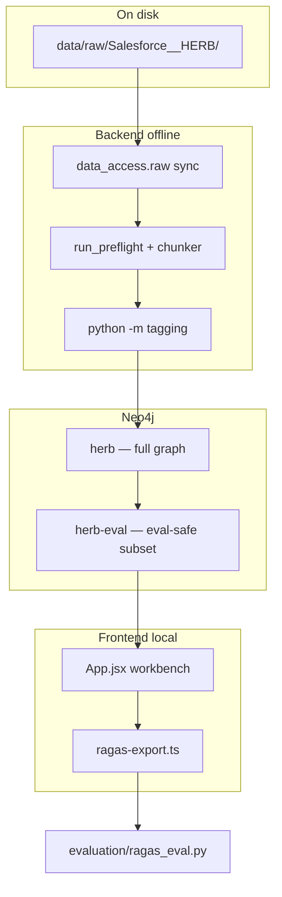
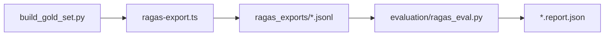

# Comprehensive codebase analysis (code-verified)

**Purpose:** Factual description of what this monorepo **is**, what has **been built**, and how it **actually works** — derived from reading implementation files, not from trusting documentation alone.

**Audience:** Thesis authors, supervisors, future agents.  
**Last updated:** 2026-05-20.  
**Companion docs:** [`thesis_pdf_vs_reality.md`](thesis_pdf_vs_reality.md), [`Thesis2026VT_korrigeringar.md`](Thesis2026VT_korrigeringar.md).

---

## 1. Executive summary

This is a **thesis monorepo** for a **graph-native RAG system** over the **Salesforce HERB** benchmark corpus. It is **not** a deployed product.

| Layer | Role |
|-------|------|
| **Backend (Python)** | Offline: raw JSON → Neo4j chunks → Anthropic two-pass tagging → materialized gates → e5 tag embeddings |
| **Frontend (Vite/React)** | Local workbench: browser-direct Neo4j + multi-provider LLMs + e5 grounding + retrieval + answer + RAGAS export |
| **Evaluation** | Gold questions from dataset → JSONL export → Python RAGAS scorer |

**Thesis delivery path (HERB only):** `Salesforce__HERB` → preflight/chunk → `python -m tagging` (full run: `pilot_full_herb`) → graph in Neo4j `herb` → eval copy `herb-eval` → browser/export → RAGAS.

**Not thesis path:** Legacy generic OpenAI indexer (`run_index.py`, quarantined), other HF datasets in registry, `clustering/queries/*.cypher` (not built).

---

## 2. Architecture (what actually runs)



**No HTTP API** between browser and data. Credentials in `VITE_*` are acceptable only because the app is local-only.

---

## 3. Repository map

```
repo/
├── backend/
│   ├── tagging/pipeline.py      # HERB semantic pipeline (~1816 lines) — thesis brain
│   ├── indexing/chunker.py      # Deterministic chunking, HERB-aware (~1314 lines)
│   ├── indexing/preflight.py    # Source/File upsert + chunk + worklist seed
│   ├── data_access/raw/         # HF sync, scan, PAYLOAD_PATTERNS for HERB
│   ├── evaluation/              # RAGAS scorer + build_gold_set (thesis eval)
│   ├── eval/                    # Older smoke RAGAS (reference-free only)
│   ├── baselines/sql_agent.py   # Non-graph SQL baseline
│   ├── schema/*.cypher          # Neo4j contract
│   └── scripts/                 # bootstrap, preflight, create_herb_eval_db, …
├── frontend/
│   ├── src/App.jsx              # Workbench UI (~3368 lines)
│   ├── src/services/            # retrieval, interpreter, answer, pipeline, embeddings
│   └── scripts/ragas-export.ts  # Headless eval producer
├── quarantine/legacy_mirror/    # .cursorignore — legacy indexer (runtime shims only in main tree)
├── ragas_exports/               # Local eval artefacts (often gitignored)
└── docs/                        # Documentation (verify against code)
```

**Often missing from clone:** `backend/data/raw/`, `backend/data/tagging_runs/`, `pilot_full_herb` zip, live Neo4j data.

---

## 4. Backend — access layer

### 4.1 Corpus acquisition

- **Registry:** `backend/data_access/raw/registry.py` — HERB → `raw/Salesforce__HERB`.
- **CLI:** `python -m data_access.raw sync` / `build`.

### 4.2 HERB payload filter

`backend/data_access/raw/adapters.py`:

```python
"Salesforce__HERB": r"^(products/.+\.json|metadata/.+\.json)$"
```

≈ **33 product JSON files + metadata** — not the entire HF tree.

### 4.3 Preflight

`backend/indexing/preflight.py`:

1. Scan `data/raw/`, filter `file_class == payload_data`.
2. `MERGE` `:Source`, `:File` (file_id = first 24 hex of sha256).
3. `Chunker.chunk_file()` — **skips if chunks already exist** for file.
4. Seeds `backend/.work/worklist_{database}.json` — **used by legacy orchestrator only**, not by `python -m tagging`.

Per-file failures logged; run continues.

---

## 5. Backend — HERB chunking

**File:** `backend/indexing/chunker.py`

### Policy

- Target 200–800 tokens, **hard max 1500** tokens (~6000 chars cap with truncation marker).
- HERB path: `_chunk_herb_json()` when path contains `Salesforce__HERB`.

### Chunk kinds (14+)

Examples: `product_profile`, `slack_thread_batch`, `document`/`document_part`, `qa_record`, `org_tree`, `pr_batch`, `unanswerable_question_batch`, …

Each chunk has `locator_json` (product, section, channel, chunk_ref, parent_ref, …) and **injected headers** in `content` for verification.

### Scale (documented in `docs/backend/status.md`)

After HERB re-chunk: **5843 chunks**, 33 files, max token estimate ~1450, no truncation markers in verification.

---

## 6. Backend — tagging pipeline

**Entry:** `python -m tagging <stage>` — `backend/tagging/__main__.py`

| Stage | LLM? | Writes |
|-------|------|--------|
| `verify-chunks` | No | Read-only format checks |
| `select` | No | `data/tagging_runs/<PILOT>/run.json` chunk list |
| `materialize` | No | Chunk scalar props + indexes |
| `extract` | Yes (Anthropic) | `description`, `HAS_TAG` edges |
| `describe` | Yes | `File.description` |
| `score` | Yes | `Chunk.relevance_to_file` |
| `embed-tags` | No (sentence-transformers) | `Tag.emb_*`, vector indexes |
| `analyze` | No | `analysis.md` locally |

### Critical defaults vs full thesis run

| Env var | Code default | `pilot_full_herb` |
|---------|--------------|-------------------|
| `PILOT_NAME` | `pilot_format_smoke` | `pilot_full_herb` |
| `TAGGING_SELECTION_MODE` | `herb_kind_coverage` | `all` |
| `TAGGING_SAMPLE_SIZE` | `14` | N/A when mode=all |

**Naive `python -m tagging extract` tags only 14 chunks** unless env is set.

### Extract — two-pass (not one call)

1. **Pass 1:** description + tag strings (`EXTRACT_SCHEMA`).
2. **Pass 2:** facet scores per tag (`SCORE_TAGS_SCHEMA`).

**`w_chunk`** computed in Python (`compute_w_chunk`), not emitted by model:

```
w_chunk = strength × coverage_bonus
strength       = sqrt(sum(f²) / N)
coverage_bonus = ((sum(f))² / (N × sum(f²))) ^ 0.25   # N=5, α=0.25
```

Multi-facet edges: primary facet (argmax) + any facet ≥ 0.50.

**Graph write:** `DELETE` existing `HAS_TAG` for chunk, then `MERGE (t:Tag {name})` + `CREATE` edges with `facet`, `w_chunk`, `w_facet`, `run_id=PILOT_NAME`.

**API:** Anthropic forced tool_use, concurrency 4, logs `io.jsonl` / `errors.jsonl`.

**Config:** `tagging/pipeline.py` uses `os.environ` directly; `NEO4J_DATABASE` defaults to **`herb`** (not `Settings` default `neo4j`).

### Materialize

- **Part A:** lift from `locator_json` → `product`, `section`, `channel`, `employee_id`, …
- **Part B:** `years` from temporal-facet **tag names** (regex 4-digit years, no range expansion)

Indexes: gated fields + `chunk_fulltext` + eval-only `chunk_content_ft`.

### embed-tags

- Deletes legacy `:TagEmbedding` nodes.
- Builds `passage: {name}. {facet scope}. {context}` from top chunk descriptions per tag/facet.
- Model: `intfloat/e5-small-v2`, dim 384, cosine, normalized.
- Properties: `emb_topic` … `emb_evidence`, `emb_all`; indexes `tag_emb_<facet>`.

---

## 7. Neo4j graph contract (HERB path)

**Authoritative:** `docs/graph_schema.md`

### Active HERB fields

| Element | Fields |
|---------|--------|
| `HAS_TAG` edge | `facet`, `w_chunk`, `w_facet`, `run_id` |
| `:Chunk` | `description`, `relevance_to_file`, materialized gate props, `years` |
| `:Tag` | `emb_*`, `embedding_model` |

### Legacy (may exist in old DBs)

- `HAS_TAG.cluster`, `canonical_id`, `weight_local`
- `(:File)-[:TAGGED]->(:Tag)` rollup — **not written by HERB pilot**
- `:Run`, `:CanonicalTag` — generic indexer only

### Scheduler state NOT in graph

`backend/.work/worklist_{db}.json` — legacy orchestrator only.

---

## 8. Eval-safe database

**Script:** `backend/scripts/create_herb_eval_db.py`

- Copies `herb` → `herb-eval` without mutating source.
- **Excludes sections:** `answerable_questions`, `unanswerable_questions`, `product_profile`.
- Copies chunks, tags, `HAS_TAG` edges; **not** file descriptions or embeddings.
- Then: `NEO4J_DATABASE=herb-eval python -m tagging embed-tags`.

**Documented counts (2026-05-19, verify on your Neo4j):** 4869 chunks, 229249 `HAS_TAG`, 24781 tags, 96790 embedding vectors.

---

## 9. Frontend — architecture

### Stack

- Vite 8, React 19, `@xyflow/react`, `neo4j-driver`, `@anthropic-ai/sdk`, `openai` (multi-provider), `@xenova/transformers` (e5 fp32 ONNX).

### Three execution modes (all real)

#### A. Usage canvas DAG (`runUsageGraph`)

Topological executors in `frontend/src/services/pipeline.ts`:

`interpret → build_input → ground → retrieve_tags` (A) and `build_input → retrieve_baseline` (B) → `answer` → `compare`.

Metrics: grounding stats, Jaccard overlap, citation parsing, latency — **computed from real runs**, not mocks.

#### B. Run Builder (`runRunSpec`)

Default specs: **A · tags** (`route: tags`), **B · baseline** (`route: baseline` = `relevance_to_file`).

Defaults: `maxChunks: 0`, `groundingK: 0`, `database: herb-eval`, `runId: pilot_full_herb`.

**Canvas defaults differ:** `maxChunks: 50`, `groundingK: 10` in `DEFAULT_USAGE_PARAMS`.

#### C. Headless RAGAS export (`ragas-export.ts`)

Same services as graph arm; writes JSONL for Python scorer.

---

## 10. Query interpretation (`interpreter.ts`)

Two-pass via generic `chat()` (not Anthropic-only):

1. Pass 1: `description`, `tags[]`, `gate` (product, section, channel, employee_id, years).
2. Pass 2: facet scores per tag.

`computeWQuery` — same formula as backend `compute_w_chunk`.

---

## 11. Retrieval (`retrieval.ts`) — core mechanism

**This is NOT multi-hop Cypher traversal.**

### Order

1. Validate dataset exists (loud error).
2. Validate hard gate — zero matches → error with valid enum (never silent broadening).
3. **Ground prompt tags:** e5 `passage:` embedding → kNN on `tag_emb_<facet>` (+ `emb_all` at 0.65 scope weight).
4. **Score chunks** — weighted overlap Cypher:

```
score = Σ w_query × facetScore × w_chunk × w_facet × relevance_to_file × sim × scopeWeight
```

Filtered by: `r.run_id` (default `pilot_full_herb`), active facets, minWChunk, minRelevanceToFile, eval section exclusions.

5. **Fallback:** if grounded tags but zero scored chunks → gated `chunk_fulltext` lexical search + warning.

6. **No tags but gate:** lexical path only.

`limit === 0` → omit `LIMIT` (uncapped retrieval — used in thesis eval).

---

## 12. Four retrieval routes (do not conflate)

| Route ID | Function | Interpret/ground? | Retrieves |
|----------|----------|-------------------|-----------|
| `tags` | `scoreGroundedChunks` | Yes | Weighted HAS_TAG |
| `baseline` | `retrieveBaseline` | Yes (plan exists) | Top `relevance_to_file` under gate |
| `content` | `retrieveBaselineContent` | No (synthetic plan) | Lucene `chunk_content_ft` on raw content |
| `module` | composed Cypher | Yes | User-defined |

### RAGAS export trap

`specToRagasConfig` maps both `baseline` and `content` Run Builder routes → export `mode: 'baseline'` → **`retrieveBaselineContent` (Lucene)**.

**Run Builder label "B · baseline"** uses `retrieveBaseline` (relevance) — **different from RAGAS B_baseline export.**

---

## 13. Answer generation (`answer.ts`)

- Modes: `raw` | `context` | `hybrid`.
- Chunks as `<chunk id="N">…</chunk>`.
- Export: `scrubApiText` + cap **200 chunks** for answer API; RAGAS `retrieved_contexts` stay full.

---

## 14. LLM providers

**Not Anthropic-only.** `frontend/src/data/models.ts` + `llm.ts`: DeepSeek (default in `.env.example`), Groq, Ollama, OpenAI, Anthropic.

Docs/README still say "Anthropic only" in places — **stale**.

---

## 15. Evaluation apparatus



### Gold questions

- From `qa_record` / `answerable_questions` in graph (`herb`).
- `ground_truth` from dataset — **not** manual thesis authoring.
- File: `frontend/scripts/ragas-questions.herb-gold100.jsonl` (100 questions).

### Export arms

| Arm | Mode | Retrieval |
|-----|------|-----------|
| A_tags | `graph` | interpret → ground → scoreGroundedChunks |
| B_baseline | `baseline` | Lucene on content, default **top 150** if limit=0 |

### RAGAS scorer

- Metrics: faithfulness, context_recall, context_precision, answer_relevancy, answer_correctness.
- Judge default: DeepSeek (OpenAI-compatible).
- Skips `meta.error`, dedupes resume duplicates.

### Pilot notes (`docs/backend/ragas_eval_report.md`)

- Initial answered: graph **90/100**, baseline **95/100** (before retry).
- API 400 errors on large Slack contexts.
- Permanent skip: `gold_personalizeforce_34` (employee not in herb-eval).
- Graph can return 1000+ chunks at limit=0 → failures.

### SQL agent baseline

`backend/baselines/sql_agent.py` — SQLite over raw HERB JSON, independent of Neo4j. Valid external comparison; barely mentioned in thesis PDF.

---

## 16. Legacy path (quarantined)

| Shim | Loads |
|------|--------|
| `scripts/run_index.py` | `run_index_legacy.py` |
| `indexing/orchestrator.py` | legacy orchestrator |
| `agents/client.py` | OpenAI-compatible client, returns never raises |

**HERB guard** (`--allow-legacy-herb-tagging`) lives in legacy script — not in main-tree shims.

`agents/schemas.py` is shim; HERB facets are in `tagging/pipeline.py` (`FACETS` tuple).

---

## 17. What is done vs not done

### Done (strong evidence)

| Item | Evidence |
|------|----------|
| HERB chunking 5843 chunks | chunker + status |
| Full tagging `pilot_full_herb` | pilot report, status |
| materialize + embed-tags on herb/herb-eval | status 2026-05-18/19 |
| Workbench real executor | pipeline.ts, commits |
| RAGAS harness + partial exports | ragas_exports/, ragas_eval_report.md |
| SQL agent baseline | sql_agent.py |

### Built but not verified in every environment

- Live Neo4j matches documented counts
- Full browser E2E click-through (status says not re-verified 2026-05-19)
- `pilot_full_herb` zip in repo
- `*.report.json` committed

### Not done / deferred

- `clustering/queries/*.cypher`
- Per-record calendar date gate (only `years` from tag names)
- Query module in batch RAGAS export
- Other datasets end-to-end
- Multi-hop graph traversal as algorithm

---

## 18. Operational reproduction (HERB)

```bash
cd backend
# pip install -r requirements.txt   # NOT requirements-lock.txt alone (missing anthropic, sentence-transformers)
cp .env.example .env
python scripts/bootstrap_schema.py
python -m data_access.raw sync   # if raw missing
python scripts/run_preflight.py --dataset-id Salesforce__HERB
export PILOT_NAME=pilot_full_herb TAGGING_SELECTION_MODE=all
python -m tagging select && python -m tagging extract
python -m tagging describe && python -m tagging score
python -m tagging materialize && python -m tagging embed-tags

python scripts/create_herb_eval_db.py --replace
NEO4J_DATABASE=herb-eval python -m tagging embed-tags

cd ../frontend && npm install && npm run dev
```

Eval:

```bash
npm --workspace frontend run ragas:export -- --config ragas_exports/A_tags.ragas.json \
  --questions frontend/scripts/ragas-questions.herb-gold100.jsonl --out ragas_exports/A_tags.jsonl
cd backend && python -m evaluation.ragas_eval --input ../ragas_exports/A_tags.jsonl ...
```

---

## 19. Documentation vs code — truth table

| Topic | Docs often say | Code does |
|-------|----------------|-----------|
| Frontend LLM | Anthropic only | Multi-provider; DeepSeek default |
| README install | `requirements-lock.txt` + `tagging extract` | Lock missing anthropic, ST; need materialize, embed-tags, env |
| Neo4j DB name | `exjobbet_index` in .env.example | Tagging → `herb`; Settings → `neo4j` |
| HERB facets | `agents/schemas.py` | `pipeline.py` FACETS; schemas is legacy shim |
| Schema indexes | `HAS_TAG.cluster` | HERB uses `facet` |
| Two RAGAS scorers | One story | `evaluation/ragas_eval.py` vs `eval/ragas_eval.py` |
| Vectors | Sometimes omitted | Central to retrieval |
| Baseline | One name | Three meanings (relevance UI, Lucene export, SQL) |

**Most trustworthy docs:** `graph_schema.md`, `backend/status.md`, `pilot_full_herb_report.md`, `ragas_eval_report.md`, `system_map.md` (if cross-checked).

---

## 20. Git evolution (intent)

| Commit | Meaning |
|--------|---------|
| `c858f37` | Tagging pilot + worklist |
| `399ee32` | HERB chunking rework |
| `452fa5d` / `c301840` | e5 grounding bundled |
| `922d0cb` | Real canvas executor |
| `5706520` | RAGAS harness |
| `da25016` | SQL baseline + export wiring |

Arc: **graph build → interactive RAG → embedding grounding → rigorous eval**.

---

## 21. Bottom line

You have built a **complete HERB-specific research stack**: deterministic segmentation → Anthropic two-pass tagging with derived weights → materialized gates → shared e5 tag vocabulary → browser graph-RAG with fail-loud validation → structured eval loop (graph vs Lucene vs optional SQL).

What is **not** finished: multi-dataset delivery, production deployment, clustering views, true calendar-date gates, unambiguous "baseline" naming in all surfaces, and **filled thesis result tables**.

The single most important operational fact: **`python -m tagging extract` with zero env is a 14-chunk smoke test**, and **"baseline" means different things** in UI, Run Builder, and RAGAS export.

---

## 22. Key file index

| Concern | File |
|---------|------|
| HERB chunking | `backend/indexing/chunker.py` |
| Preflight | `backend/indexing/preflight.py` |
| Tagging | `backend/tagging/pipeline.py` |
| Retrieval math | `frontend/src/services/retrieval.ts` |
| Pipeline orchestration | `frontend/src/services/pipeline.ts` |
| RAGAS export | `frontend/scripts/ragas-export.ts` |
| RAGAS score | `backend/evaluation/ragas_eval.py` |
| Eval DB | `backend/scripts/create_herb_eval_db.py` |
| Graph schema | `docs/graph_schema.md` |
| Live status | `docs/backend/status.md` |
